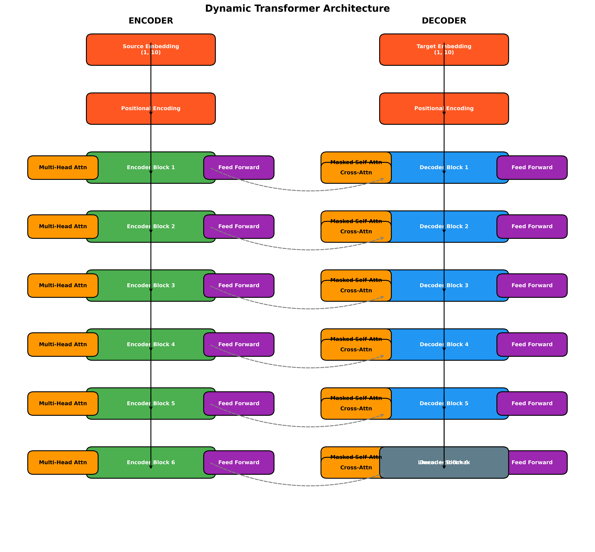
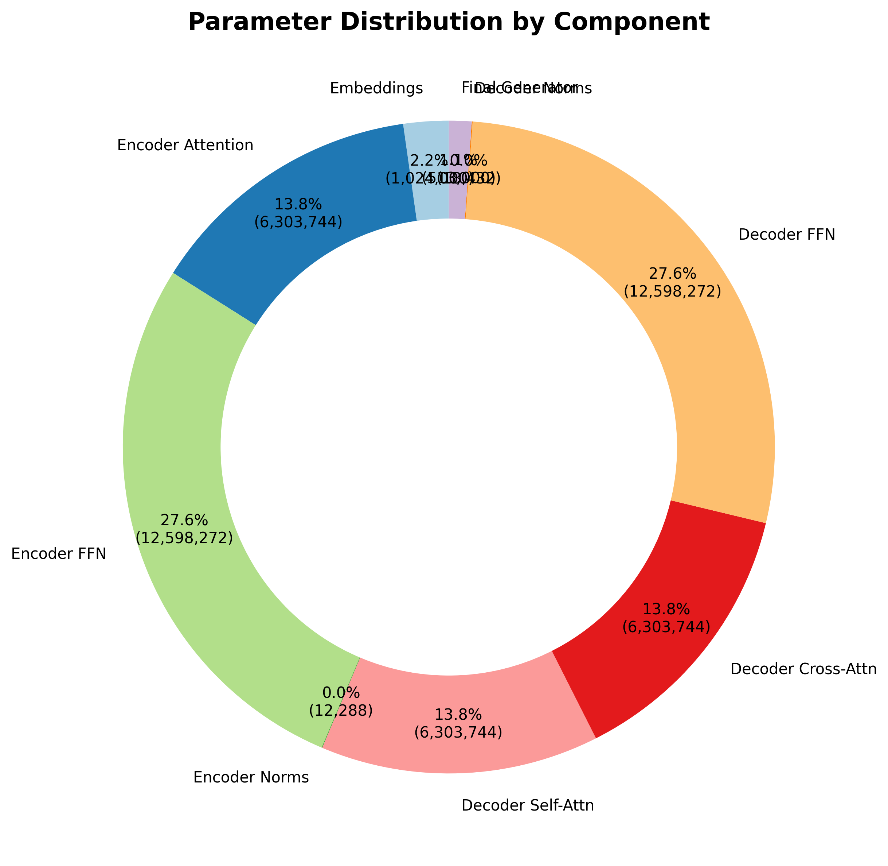
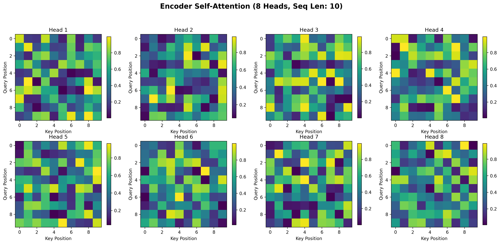
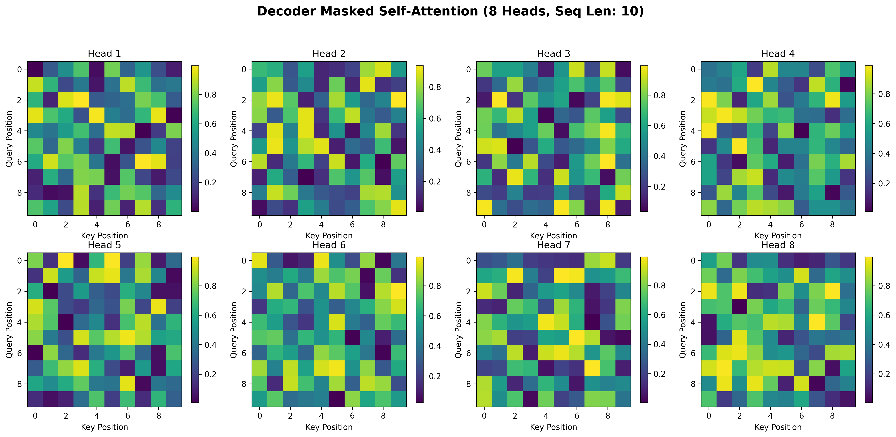
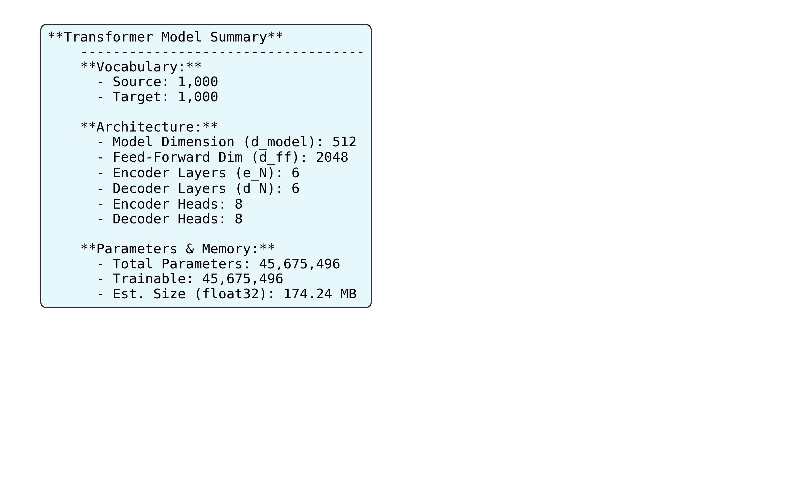

# Transformer Model Visualization
*Generated on: 2025-06-23 00:32:06*

## Model Configuration
| Parameter | Value |
|---|---|
| Source Vocabulary | 1,000 |
| Target Vocabulary | 1,000 |
| Model Dimension (d_model) | 512 |
| Feed-Forward Dim (d_ff) | 2048 |
| Encoder Layers (e_N) | 6 |
| Decoder Layers (d_N) | 6 |
| Encoder Heads | 8 |
| Decoder Heads | 8 |
| Input Size (Batch, Seq) | `[(1, 10), (1, 10)]` |

## Visualizations

### Architecture

### Parameter Breakdown

### Attention Heads

#### Encoder Self-Attention

#### Decoder Masked Self-Attention

### Model Summary

